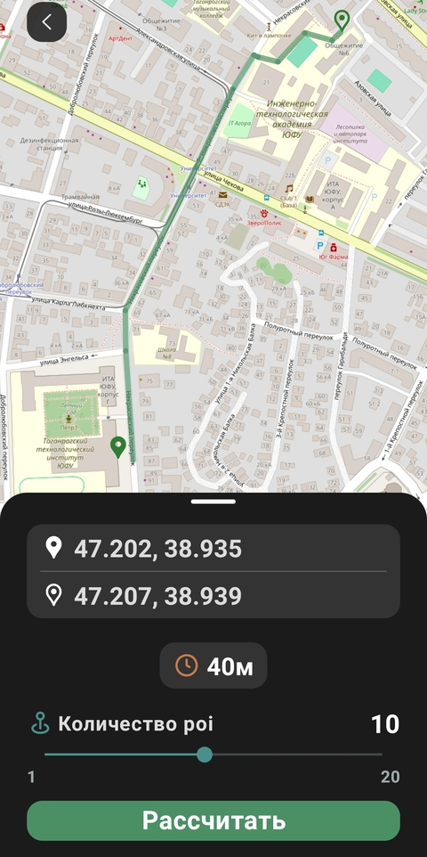
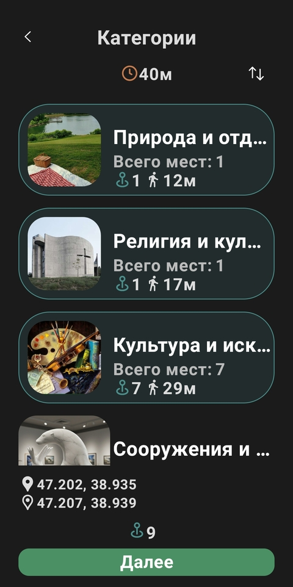
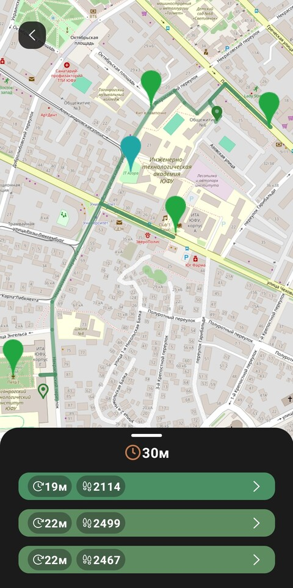
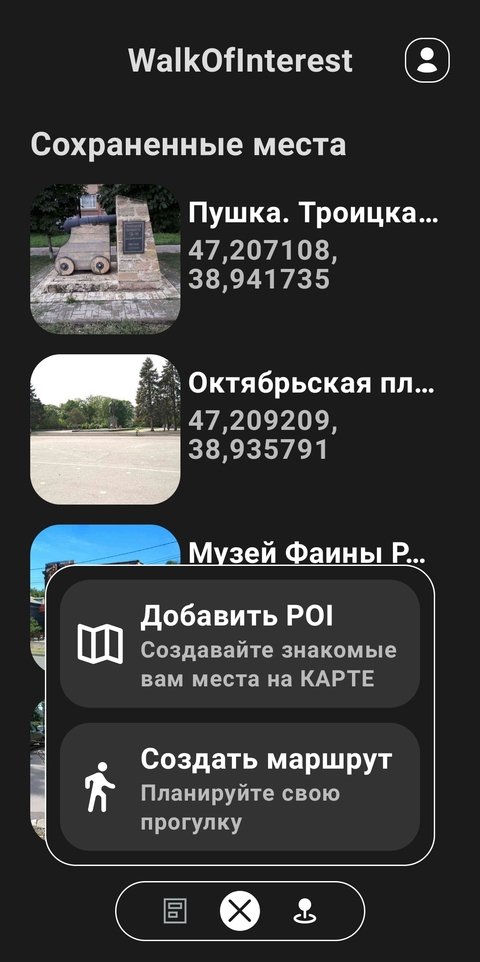
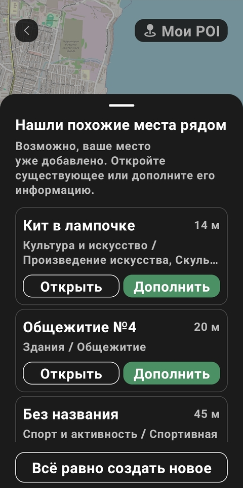
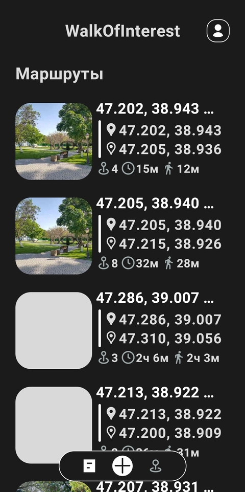
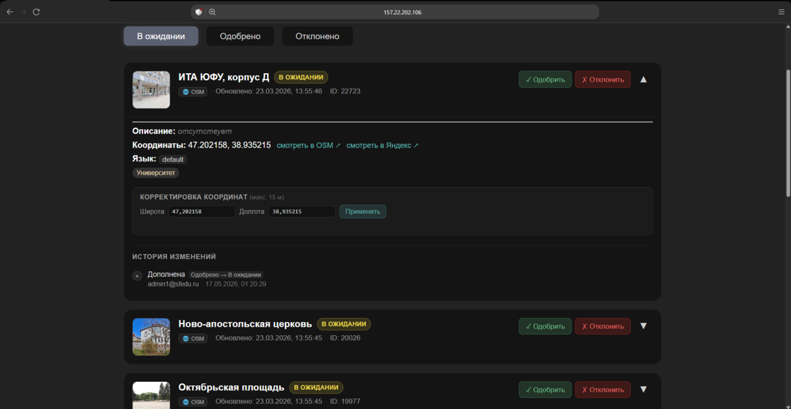
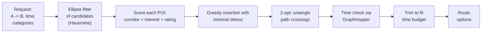
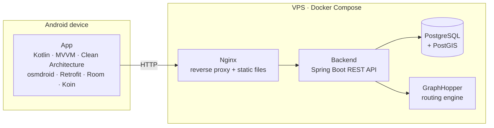

# Walk of Interest

[Русский](README.md) | **English**

An Android app that generates walking routes through interesting places - based on the user's interest categories, available time, and start/end points.

> A two-hour gap between meetings in an unfamiliar city. You'd love a walk past something worth seeing, but there's no time to plan. Regular maps route you from A to B - Walk of Interest routes you *through the most interesting places along the way*.


The backend lives in a separate repository: [WalkOfInterest-backend](https://github.com/artemalo/WalkOfInterest-backend) (included here as a git submodule).

---

## Screenshots

### Route generation

| Route parameters                                                                        | Category selection                                                               | Generated options                                                              |
|:---------------------------------------------------------------------------------------:|:--------------------------------------------------------------------------------:|:------------------------------------------------------------------------------:|
|  |  |  |

The user sets start/end points, a time budget, and a POI count, picks interesting categories - the app offers several route options with walking time and distance.

### Map and creation

| Creation menu                                                                        | Subcategories:<br/>manual POI picking                                                   |
|:------------------------------------------------------------------------------------:|:---------------------------------------------------------------------------------------:|
|  |  |

### Points of interest

| Adding a POI                                 | Similar places nearby                               | POI card and reviews                      |
|:--------------------------------------------:|:---------------------------------------------------:|:-----------------------------------------:|
|  |  |  |

### Profile and saved items

| Profile                                 | My POIs                                 | Saved routes                             |
|:---------------------------------------:|:---------------------------------------:|:----------------------------------------:|
|  |  |  |

### Moderation

User-submitted points go through moderation in a web panel (Spring MVC + Thymeleaf) built into the backend:



## Features

- Generates several interest-based walking route options in seconds
- 60+ POI subcategories (museums, parks, viewpoints, architecture…) with "interestingness" weights
- Respects the time budget: real walking time is computed by the routing engine
- Reviews, ratings, and likes for points; ratings affect route inclusion
- User-submitted points with moderation via the web panel
- JWT auth (access + refresh with rotation), profile with walking stats
- Offline storage of routes and saved points (Room)
- Open data only (OpenStreetMap) - works for any region

## How a route is built

The core of the project is a custom POI selection and ordering algorithm:



1. **Spatial filtering.** Candidates are selected by an ellipse with foci at A and B: `d(T,A) + d(T,B) ≤ 2a` - the detour to any point stays reasonable. Distances use the Haversine formula (error < 0.3% up to 10 km).
2. **Scoring.** `score = (0.3·corridor + 0.4·interest + 0.2·rating) × status × bonus`, where "corridor" is Gaussian proximity to the A->B line (σ = 300 m), "interest" is the subcategory weight for the user's profile, and "rating" is passed through a sigmoid `σ((rate-3)·lg(votes+1))` so a single five-star review loses to many consistent ratings.
3. **Assembly and optimization.** Greedy insertion of each point where it lengthens the path the least -> 2-opt untangles crossings (test route: 96 min -> 78 min) -> real walking time is verified against GraphHopper -> excess points are dropped in ascending value order until the route fits the time budget.

## Architecture



All server components are isolated containers on a single VPS (2 GB RAM, with per-container memory limits); only Nginx is exposed.

### Mobile app - Clean Architecture + MVVM

Presentation and data layers depend on the domain layer (pure Kotlin, no Android SDK): 37 use cases, 8 repository interfaces, domain models. Swapping Retrofit or Room does not touch business logic.

- **Presentation:** Fragment/ViewModel + StateFlow, Navigation Component, DataBinding
- **Domain:** use cases and interfaces - framework-free
- **Data:** 8 repositories, 5 Retrofit APIs, Room (offline routes and points), EncryptedSharedPreferences for tokens, TokenAuthenticator with automatic refresh

### Backend - layered architecture

9 controllers -> 12+ services (wired only via DI) -> 9 Spring Data JPA repositories; spatial queries in native SQL + PostGIS (`ST_Within` / `ST_DWithin`, GiST indexes). POIs are imported by a custom OSM PBF parser (osm4j) with batch inserts and categorization into 60+ weighted subcategories. Cross-cutting concerns: JWT filter, global exception handler, rate limiting (Bucket4j, token bucket), GraphHopper client. Details and the database schema are in the [backend README](https://github.com/artemalo/WalkOfInterest-backend).

## Tech stack

| Layer              | Technologies                                                                                                                                                                       |
| ------------------ | ---------------------------------------------------------------------------------------------------------------------------------------------------------------------------------- |
| **Mobile**         | Kotlin, MVVM + Clean Architecture, osmdroid, Retrofit + OkHttp, Room + KSP, Koin, Coil, Security-Crypto, Navigation Component                                                      |
| **Backend**        | Java 25, Spring Boot 4 (Web/WebFlux), Spring Security + JWT, Spring Data JPA + Hibernate, PostgreSQL + PostGIS, Bucket4j, springdoc-openapi, osm4j + JTS, Thymeleaf, Lombok, Maven |
| **Infrastructure** | Docker Compose, Nginx, GraphHopper (foot profile, Contraction Hierarchies, SRTM elevation), VPS                                                                                    |

### Why GraphHopper

Google Directions - from $5 per 1000 requests; Yandex - geographic restrictions; OSRM - no isochrones, profile changes require recompilation. GraphHopper: free self-hosted, REST `/isochrone` (polygon handed to PostGIS as WKT), Contraction Hierarchies for fast queries, SRTM elevation support.

## Repository layout

```
WalkOfInterest/
├── app/                      # Android app (Kotlin)
├── WalkOfInterest-backend/   # Backend (git submodule -> separate repository)
├── graphhopper/              # Routing engine configuration
├── docker-compose.yml        # Orchestration: PostGIS, GraphHopper, backend, Nginx
└── docs/
    ├── DEPLOYMENT.md         # Full VDS deployment guide (in Russian)
    └── images/
```

## Getting started

**Server** (Docker Compose: PostGIS + GraphHopper + backend + Nginx):

```bash
git clone --recurse-submodules https://github.com/artemalo/WalkOfInterest.git
cd WalkOfInterest
# fill in .env (see docs/DEPLOYMENT.md), put an OSM map into data/graphhopper/
docker compose up -d
```

Full instructions, including setting up a bare 2 GB RAM VDS: [docs/DEPLOYMENT.md](docs/DEPLOYMENT.md).

**App:** open `app/` in Android Studio, set `SERVER_URL` in `local.properties`, build (minSdk 24).

## Roadmap

Recommendations based on walking history, "comfortable" routes avoiding major roads, offline mode, route export to navigation apps.
