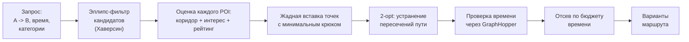
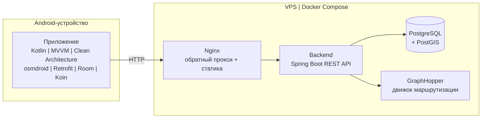

# Walk of Interest

**Русский** | [English](README.en.md)

Мобильное приложение для генерации пешеходных маршрутов через интересные места - по категориям интересов пользователя, доступному времени и точкам «откуда/куда».

> Между встречами - окно в 2 часа в незнакомом городе. Хочется погулять и увидеть что-то стоящее, но планировать маршрут некогда. Обычные карты строят путь из A в B - Walk of Interest строит прогулку *через самое интересное по пути*.


Backend вынесен в отдельный репозиторий: [WalkOfInterest-backend](https://github.com/artemalo/WalkOfInterest-backend) (подключен сюда как git submodule).

---

## Скриншоты

### Генерация маршрута

| Параметры маршрута                                     | Выбор категорий                                                                 | Готовые варианты                                                                  |
|:------------------------------------------------------:|:-------------------------------------------------------------------------------:|:---------------------------------------------------------------------------------:|
|  |  |  |

Пользователь задаёт точки «откуда/куда», лимит времени и количество POI, выбирает интересные категории - приложение предлагает несколько вариантов маршрута с временем и длиной пути.

### Карта и создание

| Меню создания                                                                                            | Подкатегории:<br/>ручной выбор POI                                                                        |
|:--------------------------------------------------------------------------------------------------------:|:---------------------------------------------------------------------------------------------------------:|
|  |  |

### Точки интереса

| Добавление POI                                                                    | Похожие места рядом                                | Карточка POI и отзывы                         |
|:---------------------------------------------------------------------------------:|:--------------------------------------------------:|:---------------------------------------------:|
|  |  |  |

### Профиль и сохранённое

| Профиль                                 | Мои POI                                                                    | Сохранённые маршруты                                                          |
|:---------------------------------------:|:--------------------------------------------------------------------------:|:-----------------------------------------------------------------------------:|
|  |  |  |

### Модерация

Точки, добавленные пользователями, проходят модерацию в веб-панели (Spring MVC + Thymeleaf), встроенной в backend:


## Возможности

- Генерация нескольких вариантов пешего маршрута по интересам за секунды
- 60+ подкатегорий POI (музеи, парки, смотровые, архитектура…) с весами «интересности»
- Учёт лимита времени: реальное время пешего пути считает движок маршрутизации
- Отзывы, оценки и лайки для точек; рейтинг влияет на попадание в маршрут
- Добавление собственных точек пользователями + модерация в веб-панели
- Регистрация/вход по JWT (access + refresh с ротацией), профиль со статистикой прогулок
- Сохранение маршрутов и точек офлайн (Room)
- Данные - только открытые источники (OpenStreetMap), работает для любого региона

## Как строится маршрут

Ядро проекта - собственный алгоритм подбора и упорядочивания POI:



1. **Пространственная фильтрация.** Кандидаты отбираются эллипсом с фокусами в точках A и B: `d(T,A) + d(T,B) ≤ 2a` - крюк к любой точке остаётся разумным. Расстояния - по формуле Хаверсина (погрешность < 0,3 % на дистанциях до 10 км).
2. **Оценка объектов.** `score = (0.3·коридор + 0.4·интерес + 0.2·рейтинг) × статус × бонус`, где «коридор» - гауссова близость к прямой A->B (σ = 300 м), «интерес» - вес подкатегории под профиль пользователя, «рейтинг» - оценка через сигмоиду `σ((rate-3)·lg(votes+1))`, чтобы одинокая «пятёрка» проигрывала множеству стабильных оценок.
3. **Сборка и оптимизация.** Жадная вставка каждой точки туда, где путь удлиняется меньше всего -> 2-opt распутывает пересечения (на тестовом маршруте: 96 мин -> 78 мин) -> реальное пешее время проверяется запросом к GraphHopper -> лишние точки отсеиваются по убыванию ценности, пока маршрут не уложится в бюджет времени.

## Архитектура



Все серверные компоненты - изолированные контейнеры на одном VPS (2 ГБ RAM, с лимитами памяти на каждый контейнер); наружу открыт только Nginx.

### Мобильное приложение - Clean Architecture + MVVM

Слои представления и данных зависят от доменного слоя (чистый Kotlin, без Android SDK): 37 use-case, 8 интерфейсов репозиториев, доменные модели. Замена Retrofit или Room не затрагивает бизнес-логику.

- **Presentation:** Fragment/ViewModel + StateFlow, Navigation Component, DataBinding
- **Domain:** use-case и интерфейсы - без зависимостей на фреймворки
- **Data:** 8 репозиториев, 5 Retrofit API, Room (офлайн-хранение маршрутов и точек), EncryptedSharedPreferences для токенов, TokenAuthenticator с автоматическим refresh

### Backend - слоистая архитектура

9 контроллеров -> 12+ сервисов (связи только через DI) -> 9 репозиториев Spring Data JPA; пространственные запросы - нативный SQL + PostGIS (`ST_Within` / `ST_DWithin`, GiST-индексы). POI наполняются собственным парсером OSM PBF (osm4j) с батч-вставкой и категоризацией по 60+ подкатегориям с весами. Сквозные функции: JWT-фильтр, глобальный обработчик ошибок, rate limiting (Bucket4j, token bucket), клиент GraphHopper. Подробности и схема БД - в [README бэкенда](https://github.com/artemalo/WalkOfInterest-backend).

## Технологический стек

| Слой               | Технологии                                                                                                                                                                         |
| ------------------ | ---------------------------------------------------------------------------------------------------------------------------------------------------------------------------------- |
| **Мобильное**      | Kotlin, MVVM + Clean Architecture, osmdroid, Retrofit + OkHttp, Room + KSP, Koin, Coil, Security-Crypto, Navigation Component                                                      |
| **Backend**        | Java 25, Spring Boot 4 (Web/WebFlux), Spring Security + JWT, Spring Data JPA + Hibernate, PostgreSQL + PostGIS, Bucket4j, springdoc-openapi, osm4j + JTS, Thymeleaf, Lombok, Maven |
| **Инфраструктура** | Docker Compose, Nginx, GraphHopper (профиль foot, Contraction Hierarchies, рельеф SRTM), VPS                                                                                       |

### Почему GraphHopper

Google Directions - от $5 за 1000 запросов; Yandex - гео-ограничения; OSRM - нет изохрон, смена профиля требует перекомпиляции. GraphHopper: бесплатный self-hosted, REST `/isochrone` (полигон отдаётся в PostGIS как WKT), Contraction Hierarchies для быстрых расчётов, учёт рельефа SRTM.

## Структура репозитория

```
WalkOfInterest/
├── app/                      # Android-приложение (Kotlin)
├── WalkOfInterest-backend/   # Backend (git submodule -> отдельный репозиторий)
├── graphhopper/              # Конфигурация движка маршрутизации
├── docker-compose.yml        # Оркестрация: PostGIS, GraphHopper, backend, Nginx
└── docs/
    ├── DEPLOYMENT.md         # Полный гайд по развертыванию на VDS
    └── images/
```

## Запуск

**Сервер** (Docker Compose: PostGIS + GraphHopper + backend + Nginx):

```bash
git clone --recurse-submodules https://github.com/artemalo/WalkOfInterest.git
cd WalkOfInterest
# заполнить .env (см. docs/DEPLOYMENT.md), положить карту OSM в data/graphhopper/
docker compose up -d
```

Полная инструкция, включая настройку чистого VDS с 2 ГБ RAM: [docs/DEPLOYMENT.md](docs/DEPLOYMENT.md).

**Приложение:** открыть `app/` в Android Studio, указать `SERVER_URL` в `local.properties`, собрать (minSdk 24).

## Планы развития

Рекомендации по истории прогулок, «комфортные» маршруты в обход магистралей, офлайн-режим, экспорт маршрутов в навигаторы.

# 
